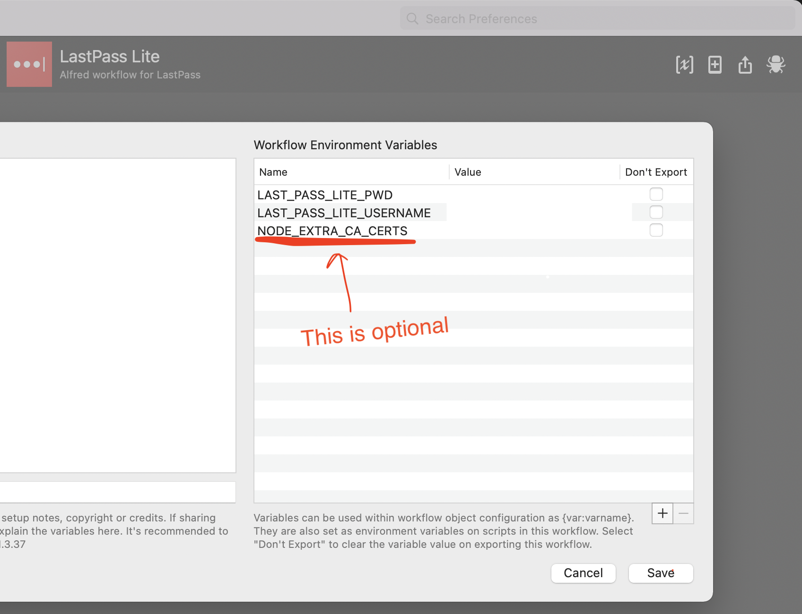

# lastpass-alfred-lite
Alfred workflow lastpass-alfred-lite

## Install
```bash
yarn global add lastpass-alfred-lite
# or 
npm install -g lastpass-alfred-lite
```

## Create vault file in the user root folder with 777 permission
```bash
cd ~/
touch .lastpass_lite_vault_file
chmod 777 .lastpass_lite_vault_file
```

## Setup global environment in alfred
**Note: only `LAST_PASS_LITE_USERNAME` and `LAST_PASS_LITE_PWD` are required. `NODE_EXTRA_CA_CERTS` is need only if you have additional certificate needs to import to node.js runtime (e.g. behind a proxy)**

