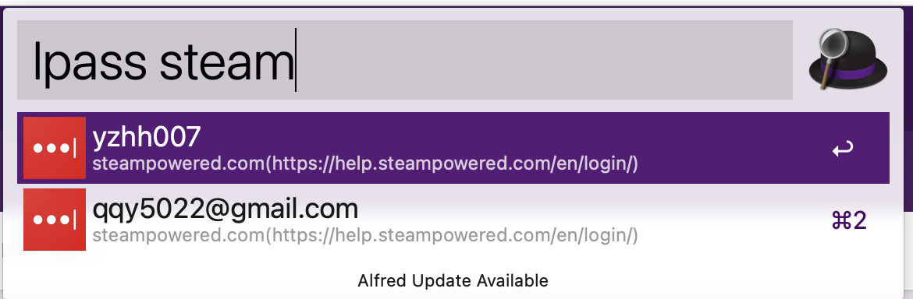

# lastpass-alfred-lite
> A lightweight alfred workflow for accessing your lastpass vault items. No `lastpass-cli` needed!



## Usage
```bash
lpass <keyword> #keyword can be the username/url/vault_entry_name
```

## Install workflow
### Install npm package
```bash
yarn global add lastpass-alfred-lite
# or 
npm install -g lastpass-alfred-lite
```

### Create vault file in the user root folder with 777 permission
```bash
cd ~/
touch .lastpass_lite_vault_file
chmod 777 .lastpass_lite_vault_file
```

### Setup global environment in alfred
* **[Required]** `LAST_PASS_LITE_USERNAME`: the username of your lastpass account
* **[Required]** `LAST_PASS_LITE_PWD`: the password of your lastpass account
* [Optional] `NODE_EXTRA_CA_CERTS`: need only if you have additional certificate needs to import to node.js runtime (e.g. behind a proxy)**

